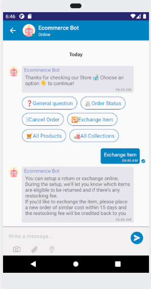

### Kommunicate Cordova (Ionic/PhoneGap) Chat SDK for Customer Support https://www.kommunicate.io/

Open Source Cordova Live Chat SDK for Ionic and PhoneGap apps




# Overview
Kommunicate provides open source live chat sdk in cordova which works with both Ionic and PhoneGap apps. Kommunicate lets you add real time live chat, in-app messaging and bot integration in your mobile applications and website for customer support.
Refer to the official docs here: https://docs.kommunicate.io/docs/cordova-installation

Signup at [https://dashboard.kommunicate.io/signup](https://dashboard.kommunicate.io/signup?utm_source=github&utm_medium=readme&utm_campaign=cordova) to get the Application ID.

## Installation
You can add the plugin using the below command:
 
`cordova plugin add kommunicate-cordova-plugin`

For ionic, use the below command:

`ionic cordova plugin add kommunicate-cordova-plugin`

## Declare Kommunicate
Declare kommunicate at the bottom of your .ts file as below to access the functions:
```js
 declare var kommunicate: any;
```

## Launch conversation
Kommunicate provides conversationBuilder function to create and launch chat directly saving you the extra steps of authentication, creation, initialization and launch. You can customize the process by building the conversationObject according to your requirements.
To launch the chat you need to create a conversation object. This object is passed to the `conversationBuilder` function and based on the parameters of the object the chat is created/launched.

Below are some examples to launch chat in different scenarios:

### Launching conversation for visitor:
If you would like to launch the conversation directly without the visiting user entering any details, then use the method as below:

```js
 let conversationObject = {
     'appId': '<APP_ID>' // The [APP_ID](https://dashboard.kommunicate.io/settings/install) obtained from kommunicate dashboard.
 }

 kommunicate.conversationBuilder(conversationObject, (conversationId) => {
     //The response will be a conversationId.
     console.log("Kommunicate create conversation successful the conversationId is : " + conversationId);
  }, (error) =>{
      console.log("Kommunicate create conversation failed : " + error);
  });
```
### Launching conversation for visitor with lead collection:
If you need the user to fill in details like phone number, emailId and name before starting the support chat then launch the chat with `withPreChat` flag as true. In this case you wouldn't need to pass the kmUser. A screen would open up for the user asking for details like emailId, phone number and name. Once the user fills the valid details (atleast emailId or phone number is required), the conversation would be launched. Use the function as below:

```js
 let conversationObject = {
     'appId': '<APP_ID>', // The [APP_ID](https://dashboard.kommunicate.io/settings/install) obtained from kommunicate dashboard.
     'withPreChat': true
 }

 kommunicate.conversationBuilder(conversationObject, (conversationId) => {
     //The response will be a conversationId.
     console.log("Kommunicate create conversation successful the conversationId is : " + conversationId);
  }, (error) =>{
      console.log("Kommunicate create conversation failed : " + error);
  });
```

### Launching conversation with existing user:
If you already have the user details then create a KMUser object using the details and launch the conversation. Use the method as below to create KMUser with already existing details:

```js
  let user = {
      'userId' : '<USER_ID>',   //Replace it with the userId of the logged in user
      'password' : '<PASSWORD>',  //Optional. Put password here if user has password, ignore otherwise
      'displayName': '<DISPLAY_NAME>' //Optional. The name that will be displayed to the agent on dashboard
      'imageLink': '<IMAGE_URL>' //Optional. The display picture for the user.
  }
  
  let conversationObject = {
     'appId': '<APP_ID>', // The [APP_ID](https://dashboard.kommunicate.io/settings/install) obtained from kommunicate dashboard.
     'kmUser': JSON.stringify(user)
  }

 kommunicate.conversationBuilder(conversationObject, (conversationId) => {
     //The response will be a conversationId.
     console.log("Kommunicate create conversation successful the conversationId is : " + conversationId);
  }, (error) =>{
      console.log("Kommunicate create conversation failed : " + error);
  });
```

If you have a different use-case and would like to customize the chat creation, user creation and chat launch, you can use more parameters in the conversationObject.

Below are all the parameters you can use to customize the conversation according to your requirements:

| Parameter        | Type           | Description  |
| ------------- |:-------------:| :-----|
| appId      | String      |   The [APP_ID](https://dashboard.kommunicate.io/settings/install) obtained from kommunicate dashboard |
| kmUser | KMUser     |    Optional, Pass the details if you have the user details, ignore otherwise. The details you pass here are used **only the first time**, to login the user. These login details persists until the app is uninstalled or you call logout. |
| withPreChat | boolean      |   Optional, Pass true if you would like the user to fill the details before starting the chat. If you have user details then you can pass false or ignore. |
| isSingleConversation| boolean      |   Optional. True by default. Pass false if you would like to create new conversation for every user. The next time user starts the chat the same conversation would open, false if you would like to create a new conversation everytime the user starts the chat. True is recommended for single chat|
| metadata      | any      |   Optional. This metadata if set will be sent with all the messages sent from that device. Also this metadata will be set to the conversations created from that device.  |
| agentIds | Array of strings     |    Optional, Pass the list of agents you want to add in this conversation. The agent ID is the email ID with which your agent is registered on Kommunicate. You may use this to add agents to the conversation while creating the conversation. Note that, conversation assignment will be done on the basis of the routing rules set in the [Conversation Rules section](https://dashboard.kommunicate.io/settings/conversation-rules). Adding agent ID here will only add the agents to the conversation and will not alter the routing rules.|
| botIds | Array of strings     |    Optional, Pass the list of bots you want to add in this conversation. Go to [bots](https://dashboard.kommunicate.io/bot) -> Manage Bots -> Copy botID . Ignore if you haven't integrated any bots. You may use this to add any number of bots to the conversation while creating the conversation. Note that this has no effect on the conversation assignee, as the [Conversation Rules](https://dashboard.kommunicate.io/settings/conversation-rules) set forth in the Dashboard will prevail.|
| createOnly      | boolean      |   Optional. Pass true if you need to create the conversation and not launch it. In this case you will receive the conversationId of the created conversation in the success callback function.|
| createAndLaunchIfEmpty     | boolean      |   Optional. Pass true if you need to create a conversation if the user does not have any conversations. If the user has one conversation, it will directly open the conversation. If the user has multiple conversations, the conversation list will open. Note that in this case the user will always get the conversation list while navigation back from the conversation. This can be avoided by passing the `skipConversationList` parameter as true.
  
## Send data to bot platform
You can set the data you want to send to the bot platform by calling the `updateChatContext` method as below:

```js
  let chatContext = {
          'key': 'value',
          'objKey': {
            'objKey1' : 'objValue1',
            'objKey2' : 'objValue2'
          }
        };

  kommunicate.updateChatContext(chatContext);
```

## Logging out the user

You can logout the user from Kommunicate using the below function:

```js
kommunicate.logout(function(response){
       //logout successfull
    }, function(response){
      //logout failed
    });
```

For sample code you can refer to our sample app made in ionic3 https://github.com/Kommunicate-io/Kommunicate-Ionic-Cordova-Sample-App


## Build a BOT on Kommunicate and integrate it in your mobile apps

### Kompose

[Kompose](https://dashboard.kommunicate.io/bots/bot-builder) is a Kommunicate’s bot builder that help you in building your own bot, a techie, non-techie, or a person who doesn’t have any idea about chatbots can also build the bot. Anyone can create a chatbot with the Kompose without any assistance.


### Following is the UI to create the BOT


## Dialogflow chatbot integration in your Cordova (Ionic/PhoneGap) SDK 

Dialogflow is a Google-owned NLP platform to facilitate human-computer interactions such as chatbots, voice bots, etc. 

Kommunicate's Dialogflow integration provides a more versatile, customizable and better chatting experience. Kommunicate Cordova (Ionic/PhoneGap) Live Chat SDK supports all of Dialogflow's features such as Google Assistant, Rich Messaging, etc. On top of that, it is equipped with advanced features such as bot-human handoff, conversation managing dashboard, reporting, and others. 

You can connect your Dialogflow chatbot with Kommunicate in the following 4 simple steps. 

### Step 1: Get your API credentials from Dialogflow
- Login to Dialogflow console and select your agent from the dropdown in the left panel.
- Click on the settings button. It will open a setting page for the agent.
- Inside the general tab search for GOOGLE PROJECTS and click on your service account.
- After getting redirected to your SERVICE ACCOUNT, create a key in JSON format for your project from the actions section and it will get automatically downloaded.

### Step 2: Create a free Kommunicate account
Create a free account on [Kommunicate](https://dashboard.kommunicate.io/signup) and navigate to the [Bots section](https://dashboard.kommunicate.io/bots/bot-integrations).

### Step 3: Integrate your Dialogflow chatbot with Kommunicate
- In the Bot integrations section, choose Dialogflow. A popup window will open.
- Upload your Key file here and proceed.
- Give a name and image to your chatbot. It will be visible to the users chatting with your chatbot.
- Enable/Disable chatbot to human handoff. If enabled, it will automatically assign conversations to humans in case the chatbot is not able to answer.

### Step 4: Install the Kommunicate Cordova (Ionic/PhoneGap) Chat SDK to your app
You can add the Kommunicate SDK in your Cordova (Ionic/PhoneGap) app easily. More information on how to integrate with your Cordova (Ionic/PhoneGap) app [https://docs.kommunicate.io/docs/cordova-installation). 

> Note: Here's a [sample chatbot](https://docs.kommunicate.io/docs/bot-samples) for you to get started with Dialogflow. 


